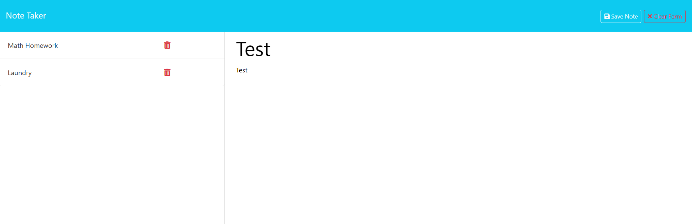

# Note Taker

Website: https://reminder-note-taker-d0de6bfbe583.herokuapp.com/

## Description

I wanted to create a simple note taker that can be accessed on the browser. It provides the function to add new notes, save notes, and delete notes. Through this application, I was able to better understand how get, post, and delete routes work to manipulate my files.

## Table of Contents (Optional)

If your README is long, add a table of contents to make it easy for users to find what they need.

- [Installation](#installation)
- [Usage](#usage)
- [Credits](#credits)
- [License](#license)

## Installation

All installations should already be installed/ added.

## Usage

Once the user enters the website, they will see a button to direct them to the note taker. In the note taker, a form is displayed to fill with anything they want. On the top right, buttons will appear if the user would like to save their note or clear. After saving, the new note will appear on the left with any other previous notes made. A red trash can can be seen next the the notes, if clicked, the user can delete the note. 

## Credits

N/A

## Codes Used

Codes all taken from module 11

## License

N/A

## Badges

N/A

## Features

N/A

## How to Contribute

N/A

## Tests

To test, type in the command line: `node server.js` and direct to `localhost:3001/`